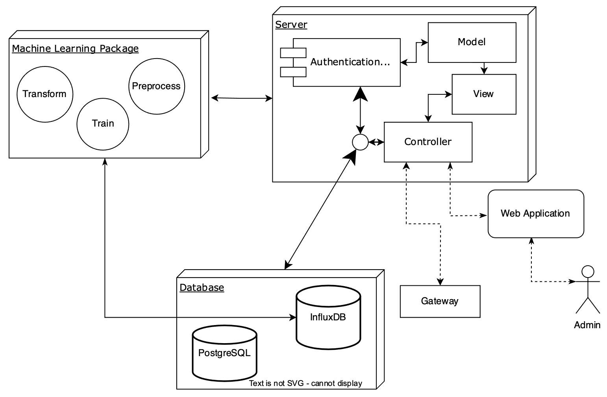
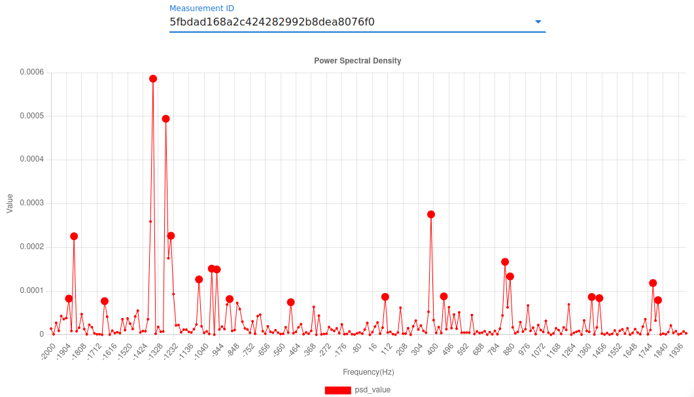

# Predictive Maintenance Using Vibration Analysis for IIoT
This repository contains all of my bachelor's thesis documents titled ```Predictive Maintenance Using Vibration Analysis for Industrial IoT Enabled Equipment``` in computer engineering at Amirkabir University of Technology under the supervision of Professor [Hamid R. Zarandi](https://scholar.google.com/citations?user=ZA9rRWAAAAAJ&hl=en).

## System's Components
* [Server](#Server)
* [Gateway](#Gateway)
* [Web](#Web)

## Server
We developed an API and analytical server for applying predictive maintenance to different equipment. Used FastAPI for providing the API server and exploited Python's AI modules and libraries for signal processing and model optimization. All the codes and documents are provided [here](https://github.com/mies47/Predictive-Maintenance-Server).



## Gateway
Exploited Raspberry PI 4 as the main gateway of the system and implemented the communication between gateway and end-nodes using Zigbee. All the codes and documents for both gateway and end-nodes are listed [here](https://github.com/mies47/Predictive-Maintenance-Gateway).

## Web
For easing the process of node management performed by admins, and also visualizing the gathered and processed data, we developed a full front-end web application using Vue.js framework. All the codes and documents are provided [here](https://github.com/mies47/Predictive-Maintenance-Web-App).


